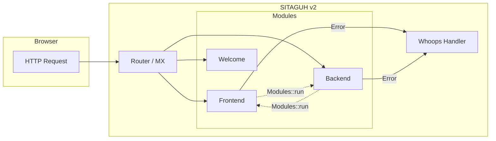

<div align="center">

# 🚀 SITAGUH v2

### CodeIgniter 3 · HMVC · Whoops Error Handler

Modular PHP web application dengan arsitektur **Hierarchical Model-View-Controller** — scalable, terorganisir, dan siap produksi.

<br/>

[](https://app.codacy.com/app/N3Cr0N/CodeIgniter-HMVC?utm_source=github.com&utm_medium=referral&utm_content=N3Cr0N/CodeIgniter-HMVC&utm_campaign=Badge_Grade_Dashboard)
[](https://www.codefactor.io/repository/github/n3cr0n/codeigniter-hmvc)


[Features](#-fitur-utama) · [Quick Start](#-quick-start) · [HMVC Guide](#-hmvc-modular-extensions) · [Whoops](#-whoops-error-handler) · [FAQ](#-faq)

</div>

---

## 📋 Daftar Isi

- [Tentang Proyek](#-tentang-proyek)
- [Tech Stack](#-tech-stack)
- [Struktur Modul](#-struktur-modul)
- [Fitur Utama](#-fitur-utama)
- [Quick Start](#-quick-start)
- [HMVC — Modular Extensions](#-hmvc-modular-extensions)
- [Whoops Error Handler](#-whoops-error-handler)
- [FAQ](#-faq)
- [Persyaratan Server](#-persyaratan-server)
- [Referensi](#-referensi)

---

## 📖 Tentang Proyek

**SITAGUH v2** dibangun di atas **CodeIgniter 3.1.10** dengan dukungan **HMVC (Modular Extensions)** dan **Whoops** untuk error handling yang informatif.

| Komponen | Deskripsi |
|----------|-----------|
| **CodeIgniter 3** | Framework PHP ringan & cepat |
| **HMVC** | Modular Extensions — controller, model, view per modul |
| **Whoops** | Error page yang cantik & mudah di-debug |
| **PHP Backward Compat** | Dukungan `each()` & `list()` untuk PHP 5.6 / 7.x |

> HMVC = **H**ierarchical **M**odel **V**iew **C**ontroller — modul independen yang bisa saling berkomunikasi tanpa request HTTP tambahan.



---

## 🛠 Tech Stack

<div align="center">

| | Teknologi | Versi |
|:---:|:---|:---:|
| 🐘 | **PHP** | 5.6+ / 7.x |
| 🔥 | **CodeIgniter** | 3.1.10 |
| 🧩 | **HMVC (Modular Extensions)** | Latest |
| 🛡️ | **Whoops** | ^2.5 |
| 📦 | **Composer** | Required |

</div>

---

## 📁 Struktur Modul

```
sitaguhv2/
├── application/
│   ├── modules/
│   │   ├── Frontend/     ← Modul tampilan publik
│   │   ├── Backend/      ← Modul panel admin
│   │   └── welcome/      ← Modul default
│   ├── config/
│   └── core/
├── system/               ← CodeIgniter core
├── vendor/               ← Composer dependencies (Whoops, dll.)
└── index.php             ← Entry point
```

---

## ✨ Fitur Utama

<table>
<tr>
<td width="50%">

### 🧩 Modular Architecture
Setiap fitur hidup di modul sendiri — controller, model, view, config, routes — siap dipindahkan antar proyek.

### 🔗 HMVC Cross-Loading
Modul bisa memanggil modul lain via `Modules::run()` tanpa request HTTP tambahan.

</td>
<td width="50%">

### ⚡ Autoload per Controller
Definisikan helper, library, dan model yang dimuat otomatis per controller.

### 🎨 Whoops Debug UI
Error page interaktif dengan stack trace, syntax highlight, dan buka file langsung di editor.

</td>
</tr>
</table>

---

## ⚡ Quick Start

### 1. Clone repository

```bash
git clone https://github.com/Syupyan/sitaguhv2.git
cd sitaguhv2
```

### 2. Install dependencies

```bash
composer install
```

### 3. Konfigurasi environment

Salin dan sesuaikan file config di `application/config/{environment}/`:

```bash
# development | production | testing
application/config/development/database.php
application/config/development/config.php
```

### 4. Jalankan server

```bash
# XAMPP / Apache — arahkan DocumentRoot ke folder proyek
# atau gunakan PHP built-in server:
php -S localhost:8080
```

Buka browser: **http://localhost:8080**

---

## 🧩 HMVC — Modular Extensions

Modular Extensions membuat CodeIgniter **modular**. Setiap modul berisi controller, model, dan view independen di sub-direktori `application/modules/`.

Module Controllers dapat digunakan sebagai controller biasa, HMVC controller, atau **widget** untuk membangun view partials.

### Konfigurasi Modul

Tambahkan lokasi modul di `application/config/config.php`:

```php
<?php
$config['modules_locations'] = array(
    APPPATH.'modules/' => '../modules/',
);
```

### Autoload di Controller

```php
<?php
class Xyz extends MX_Controller
{
    public $autoload = array(
        'helper'    => array('url', 'form'),
        'libraries' => array('email'),
    );
}
```

### Constructor (PHP5 Style)

```php
<?php
class Xyz extends MX_Controller
{
    function __construct()
    {
        parent::__construct();
    }
}
```

### Routing per Modul

Setiap modul dapat memiliki `config/routes.php`:

```php
<?php
$route['module_name'] = 'controller_name';
```

### Memanggil Modul

| Skenario | Syntax |
|----------|--------|
| Modul & controller berbeda | `Modules::run('module/controller/method', $params)` |
| Nama sama, method bukan `index` | `Modules::run('module/method', $params)` |
| Nama sama, method `index` | `Modules::run('module', $params)` |
| Dari controller lain | `$this->load->module('module/controller')` |
| Sebagai view partial | `<?php echo Modules::run('module/method', $param); ?>` |

<details>
<summary><strong>📌 Catatan Penting HMVC</strong></summary>

<br/>

- Untuk HMVC (`Modules::run()`), controller **harus** extend `MX_Controller`
- Untuk Modular Separation saja, extend `CI_Controller`
- Semua library `MY_*` harus extend class `MX_*` yang setara
- Controller bisa dimuat dari `application/controllers/` atau `module/controllers/`
- Cross-load resource antar modul: `$this->load->model('module/model')`
- Output `Modules::run()` di-buffer — `$this->load->view()` tidak perlu `return`
- Load bahasa modul: `$this->load->language('language_file')`
- Config: `$config = $this->load->config('config_file')`

**Form Validation dengan MX:**

```php
<?php
// application/libraries/MY_Form_validation.php
class MY_Form_validation extends CI_Form_validation
{
    public $CI;
}
```

```php
<?php
class Xyz extends MX_Controller
{
    function __construct()
    {
        parent::__construct();
        $this->load->library('form_validation');
        $this->form_validation->CI =& $this;
    }
}
```

</details>

---

## 🛡️ Whoops Error Handler

<div align="center">


*Pretty error interface untuk debugging yang lebih cepat*

</div>

**Whoops** adalah error handler framework untuk PHP — stack-based, fleksibel, dan mudah diintegrasikan.

### Fitur Whoops

| Fitur | Keterangan |
|-------|------------|
| 🔀 Stack-based handling | Error ditangani secara berlapis |
| 📦 Stand-alone | Tanpa dependency wajib |
| 🖥️ Pretty error page | UI debug yang informatif |
| ✏️ Editor integration | Buka file langsung di IDE |
| 📡 Multi-format | JSON, XML, SOAP handlers |

### Built-in Handlers

| Handler | Fungsi |
|---------|--------|
| [`PrettyPageHandler`](https://github.com/filp/whoops/blob/master/src/Whoops/Handler/PrettyPageHandler.php) | Error page cantik untuk web |
| [`PlainTextHandler`](https://github.com/filp/whoops/blob/master/src/Whoops/Handler/PlainTextHandler.php) | Output plain text untuk CLI |
| [`JsonResponseHandler`](https://github.com/filp/whoops/blob/master/src/Whoops/Handler/JsonResponseHandler.php) | Response JSON untuk AJAX |
| [`XmlResponseHandler`](https://github.com/filp/whoops/blob/master/src/Whoops/Handler/XmlResponseHandler.php) | Response XML untuk AJAX |
| [`CallbackHandler`](https://github.com/filp/whoops/blob/master/src/Whoops/Handler/CallbackHandler.php) | Wrap closure sebagai handler |

> Dokumentasi lengkap: [github.com/filp/whoops](https://github.com/filp/whoops)

---

## ❓ FAQ

<details>
<summary><strong>Apa itu modul, dan mengapa harus menggunakannya?</strong></summary>

<br/>

Modul adalah unit kode independen yang mengikuti prinsip **modular programming** — setiap fitur terisolasi, reusable, dan mudah di-maintain.

- [Module (Wikipedia)](http://en.wikipedia.org/wiki/Module)
- [Modular Programming](http://en.wikipedia.org/wiki/Modular_programming)
- [A Modular Approach to Web Development](http://blog.fedecarg.com/2008/06/28/a-modular-approach-to-web-development)

</details>

<details>
<summary><strong>Apa itu Modular HMVC?</strong></summary>

<br/>

**Modular HMVC** = Hierarchy of multiple MVC triads.

Berguna saat Anda perlu memuat view beserta datanya **di dalam view lain**. Contoh: shopping cart di halaman produk — cart punya controller, model, dan view sendiri, dimuat langsung tanpa melibatkan controller utama.

Di CodeIgniter standar, hanya 1 controller per request. HMVC mensimulasikan multiple controller via **Modular Extensions**.

| | Library | HMVC Class |
|---|---------|------------|
| CI instance | Perlu `$this` manual | Otomatis |
| Lokasi | `libraries/` | `modules/` |

</details>

<details>
<summary><strong>Apakah Modular Extensions = Modular Separation?</strong></summary>

<br/>

**Ya dan tidak.**

Keduanya membuat modul **portable** — cukup copy satu folder modul ke proyek lain. Modular Extensions **melangkah lebih jauh**: modul bisa saling berkomunikasi dan mengembalikan output controller tanpa melalui HTTP.

</details>

---

## 💻 Persyaratan Server

| Requirement | Detail |
|-------------|--------|
| **PHP** | 5.6 atau lebih baru (disarankan 7.x) |
| **Web Server** | Apache / Nginx |
| **Database** | MySQL / MariaDB (opsional, sesuaikan config) |
| **Composer** | Untuk dependency management |

> Proyek ini sudah include backward function untuk `each()` dan `list()` di HMVC — kompatibel PHP 5.6 & 7.2.

---

## 📚 Referensi

| Sumber | Link |
|--------|------|
| HMVC Modular Extensions | [Wiredesignz / Bitbucket](https://bitbucket.org/wiredesignz/codeigniter-modular-extensions-hmvc) |
| Whoops Framework | [github.com/filp/whoops](https://github.com/filp/whoops) |
| CodeIgniter 3 Docs | [codeigniter.com/user_guide](https://codeigniter.com/user_guide) |
| CodeIgniter Source | [github.com/bcit-ci/CodeIgniter](https://github.com/bcit-ci/CodeIgniter) |
| CI3 Translations | [github.com/bcit-ci/codeigniter3-translations](https://github.com/bcit-ci/codeigniter3-translations) |

---

<div align="center">

**SITAGUH v2** · Built with CodeIgniter HMVC

<br/>

⭐ Star repo ini jika bermanfaat!

</div>
